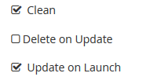

= Exercise 1.2 - Configuring Ansible Tower

In this exercise, we are going to configure Tower so that we can run a playbook.
	
There are a number of constructs in the Ansible Tower UI that enable multi-tenancy, notifications, scheduling, etc. However, we are only going to focus on a few of the key constructs that are required for this workshop today.

. Credentials
. Projects
. Inventory
. Job Template

[.lead]
*Logging into Tower and Installing the License Key*

*Step 1:* To log in, use the username *admin* and and the password *ansibleWS*.

image::images/ansible_tower_login.jpg[]
Figure 3: Ansible Tower Login Screen

As soon as you login, you will prompted to request a license or browse for an existing license file

image::images/uploading_a_license.jpg[]
Figure 4: Uploading a License

*Step 2:* In a seperate browser tab, browse to https://www.ansible.com/workshop-license to request a workshop license.

*Step 3:* Back in the Tower UI, choose *BROWSE* and upload the license file you recieved via e-mail.

*Step 4:* Select *"I agree to the End User License Agreement"*

*Step 5:* Click on *SUBMIT*

[.lead]
*Creating a Credential*

Credentials are utilized by Tower for authentication when launching jobs against machines, synchronizing with inventory sources, and importing project content from a version control system.

There are many types of credentials including machine, network, and various cloud providers. In this workshop, we are using a machine credential.

*Step 1:* Select the gear icon image:images/gear.png[Gear, title="Gear"]

*Step 2:* Select CREDENTIALS

*Step 3:* Click on ADD image:images/add.png[Add, title="Add"]

*Step 4:* Complete the form using the following entries

|===
*NAME* | Ansible Workshop Credential
|
*DESCRIPTION* | Credentials for Ansible Workshop
|
*ORGANIZATION* | Default
|
*TYPE* | Machine
|
*USERNAME* | Your Workshop Username - Student(x)
|
*PASSWORD* | Your Workshop Password
|
*PRIVILEGE ESCALATION* | Sudo (This is the default)
|===

image::images/adding_a_credential.png[]
Figure 5: Adding a Credential

Step 5: Select SAVE image:images/save.png[Save, title="Save"]

[.lead]
*Creating a Project*

A Project is a logical collection of Ansible playbooks, represented in Tower. You can manage playbooks and playbook directories by either placing them manually under the Project Base Path on your Tower server, or by placing your playbooks into a source code management (SCM) system supported by Tower, including Git, Subversion, and Mercurial.

*Step 1:* Click on PROJECTS

*Step 2:* Select ADD image:images/add.png[]

*Step 3:* Complete the form using the following entries

|===
*NAME* | Ansible Workshop Project
|
*DESCRIPTION* | Workshop playbooks
|
*ORGANIZATION* | Default
|
*SCM TYPE* | Git
|
*SCM URL* | https://github.com/ansible/lightbulb
|
*SCM BRANCH* | 
|
*SCM UPDATE OPTIONS* | 
|===
image::images/defining_a_project.png[]
Figure 6: Defining a Project

*Step 4:* Select SAVE image:images/save.png[Save, title='Save']

[.lead]
*Creating an Inventory*

An inventory is a collection of hosts against which jobs may be launched. Inventories are divided into groups and these groups contain the actual hosts. Groups may be sourced manually, by entering host names into Tower, or from one of Ansible Towers supported cloud providers.

An Inventory can also be imported into Tower using the tower-manage command and this is how we are going to add an inventory for this workshop.

*Step 1:* Click on *INVENTORIES*

*Step 2:* Select ADD image:images/add.png[Add, tile='Add']

*Step 3:* Complete the form using the following entries

|===
NAME | Ansible Workshop Inventory
|
DESCRIPTION | Ansible Inventory
|
ORGANIZATION | Default
|===
image::images/create_an_inventory.png[]
Figure 7: Create an Inventory

*Step 4:* Select SAVE image:images/save.png[]

*Step 5:* Using ssh, login to your control node

*ssh <username>@<IP_Address_of_your_control_node>*

*Step 6:* Use the tower-manage command to import an existing inventory. (Be sure to replace <username> with your actual username)

*sudo tower-manage inventory_import --source=/home/<username>/lightbulb/lessons/lab_inventory/<username>-instances.txt --inventory-name="Ansible Workshop Inventory"*

You should see output similar to the following:

image::images/import_inventory.png[]
Figure 8: Importing an inventory with tower-manage

Feel free to browse your inventory in Tower. You should now notice that the inventory has been populated with Groups and that each of those groups contain hosts.

image::images/inventory_with_groups.png[]
Figure 9: Inventory with Groups

image::images/web_inventory_group_detail.png[]
Figure 10: web inventory group detail

[.lead]
*End Result*

At this point, we are doing with our basic configuration of Ansible Tower. In the next exercise, we will be solely focused on creating and running a job template so you can see Tower in action.
