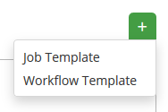

= Exercise 1.3 - Creating and Running a Job Template

A job template is a definition and set of parameters for running an Ansible job. 

Job templates are useful to execute the same job many times.

[.lead]
=  *Creating a Job Template*

==== *+++<u>Step 1:</u>+++* 
Select TEMPLATES icon 

==== *+++<u>Step 2:</u>+++* 
Click on ADD Job Template 

==== *+++<u>Step 3:</u>+++* 
Complete the form using the following values and SAVE

|===
NAME | Apache Basic Job Template
|
DESCRIPTION | Template for the apache-basic-playbook
|
JOB TYPE | Run
|
INVENTORY | Ansible Workshop Inventory
|
PROJECT | Ansible Workshop Project
|
PLAYBOOK | examples/apache-basic-playbook/site.yml
|
CREDENTIAL | Ansible Workshop Credential
|
LIMIT | web
|
OPTIONS | image:images/enable_priviledge.png[]
|===

image::images/detail_job_template.png[]
Figure 11: Job Template Form

==== *+++<u>Step 4:</u>+++* 
Select SAVE image:images/save.png[]

==== *+++<u>Step 5:</u>+++* 
Select ADD SURVEY 

==== *+++<u>Step 6:</u>+++* 
Complete the survey form with following values

|===
PROMPT | Please enter a test message for your new website
|
DESCRIPTION | Website test message prompt
|
ANSWER VARIABLE NAME | apache_test_message
|
ANSWER TYPE | Text
|
MINIMUM/MAXIMUM LENGTH | Use the defaults
|
DEFAULT ANSWER | Be creative, keep it clean, we're all professionals here
|===

image::images/survey_form.png[]
Figure 12: Survey Form

==== *+++<u>Step 7:</u>+++* 
Select ADD image:images/add.png[]

==== *+++<u>Step 8:</u>+++* 
Select SAVE image:images/save.png[]

==== *+++<u>Step 9:</u>+++* 
Back on the main Job Template page, select SAVE image:images/save.png[] again.

[.lead]
= *Running a Job Template*

Now that you've sucessfully created your Job Template, you are ready to launch it. Once you do, you will be redirected to a job screen which is refreshing in realtime showing you the status of the job.

==== *+++<u>Step 1:</u>+++* 
Select JOB TEMPLATES icon  +

NOTE: Alternatively, if you haven't navigated away from the job templates creation page, you can scroll down to see all existing job templates

==== *+++<u>Step 2:</u>+++* 
Click on the rocketship icon image:images/rocket.png[] for the *Apache Basic Job Template*

==== *+++<u>Step 3:</u>+++* 
When prompted, enter your desired test message

image::images/survey_prompt.png[]
Figure 13: Survey Prompt

==== *+++<u>Step 4:</u>+++* 
Select LAUNCH image:images/launch.png[]

==== *+++<u>Step 5:</u>+++* 
Sit back, watch the magic happen

Once the job is running, on the left, you'll have details in regards to what playbook it's running, what the status is, i.e. pending, running, or complete. You'll also notice the apache_test_message being passed in as an 'extra_variable.'

To the right, you can view standard output; the same way you could if you were running Ansible Core from the command line.

image::images/job_summary.png[]
Figure 14: Job Summary

You can also click on the nodes in the standard output under a specific task for additional information. ---

image::images/play_and_task_details.png[]
Figure 15: Play and Task Details

==== *+++<u>Step 6:</u>+++* 
Once your job is sucessful, navigate to your new website

http://<IP_of_node-1_or_node-2>

If all went well, you should see something like this, but with your own custom message of course.

image::images/new_website.png[]
Figure 17: New Website with Personalized Test Message

[.lead]
= *End Result*

At this point in the workshop, you've experienced the core functionality of Ansible Tower. But wait…? there's more! You've just begun to explore the possibilities of Ansible Core and Tower. Take a look at the resources page in this guide to explore some more features.

link:TableOfContents.adoc[Table Of Contents]